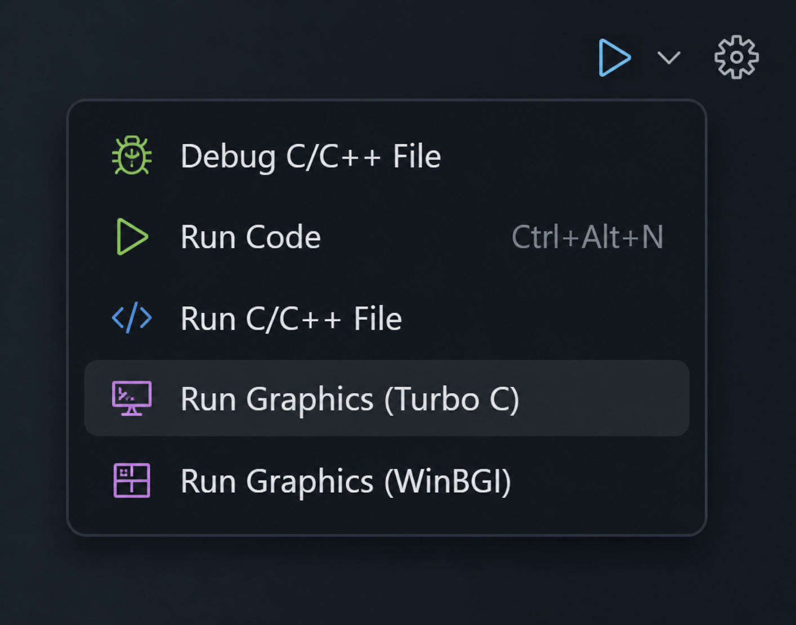
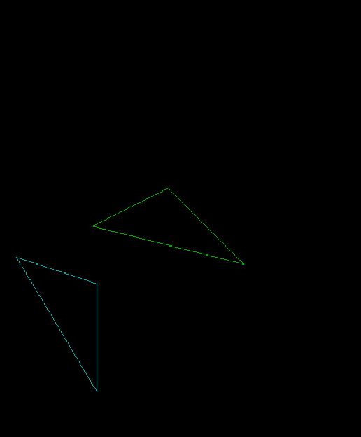
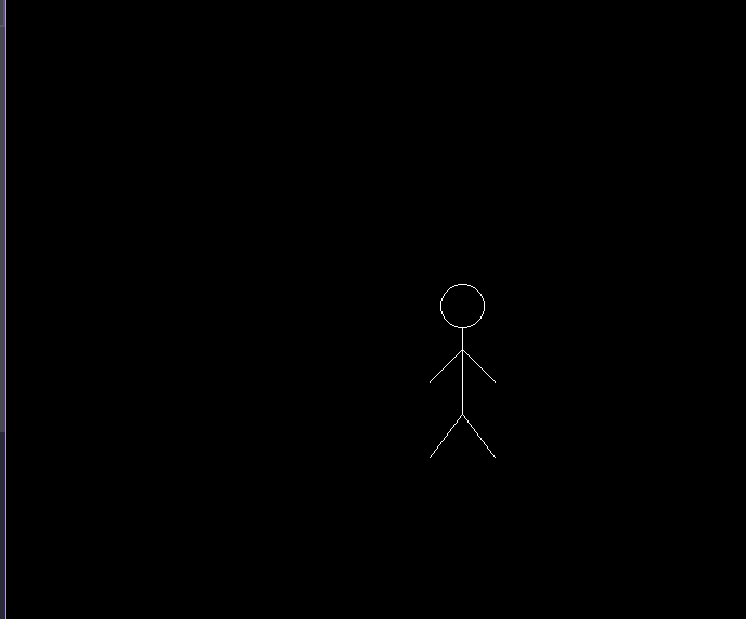
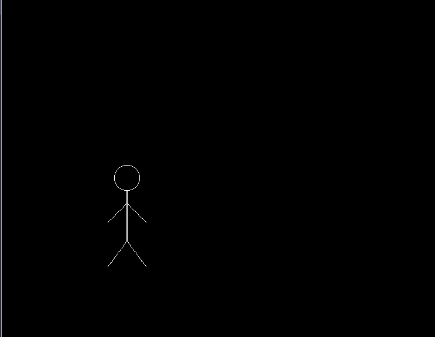

# Computer Graphics Lab Programs

## Setup

Install the **Graphics.h Compiler** extension from VS Code Marketplace:

[Graphics.h Compiler - VS Marketplace](https://marketplace.visualstudio.com/items?itemName=AlbatrossC.graphics-h-compiler)

### How to Use

1. Install the extension from the link above.
2. Write your C++ graphics program (e.g., `lab1.cpp`) using `graphics.h` functions.
3. Open the `.cpp` file in VS Code.
4. Press **F1** and run **Graphics.h Compiler: Run** or use the shortcut provided by the extension like the image above.
5. The extension compiles and runs your program using the WinBGIm graphics library.

**What to use:** This extension compiles C++ code with `graphics.h` using the WinBGIm library on Windows. It handles linking and setup automatically so you don't need to manually configure compiler flags.

---

## Programs

| Lab File | Topic | Screenshot |
|---------|-------|------------|
| `lab1.cpp` | Translation and Scaling of Triangle |  |
| `lab2.cpp` | DDA Line Drawing Algorithm |  |
| `lab3.cpp` | Bresenham Line Drawing Algorithm (BLA) |  |
| `lab4.cpp` | Mid-Point Circle Drawing Algorithm |  |
| `lab5.cpp` | Reflection Transformation (X-axis & Y-axis) |  |
| `lab6.cpp` | Rotation Transformation (+45°) |  |
| `lab7.cpp` | Cohen-Sutherland Line Clipping Algorithm |  |
| `lab8.cpp` | Car Animation using graphics.h |   |
| `lab9.cpp` | Human Body Animation |   |
| `lab10.cpp` | Mid-Point Ellipse Drawing Algorithm |  |
| `lab11.txt` | Windows GUI Familiarization | — |

---

## License

These programs were developed as part of the **Computer Graphics & Animation Lab** coursework.  
See the [LICENSE](LICENSE) file for details.
